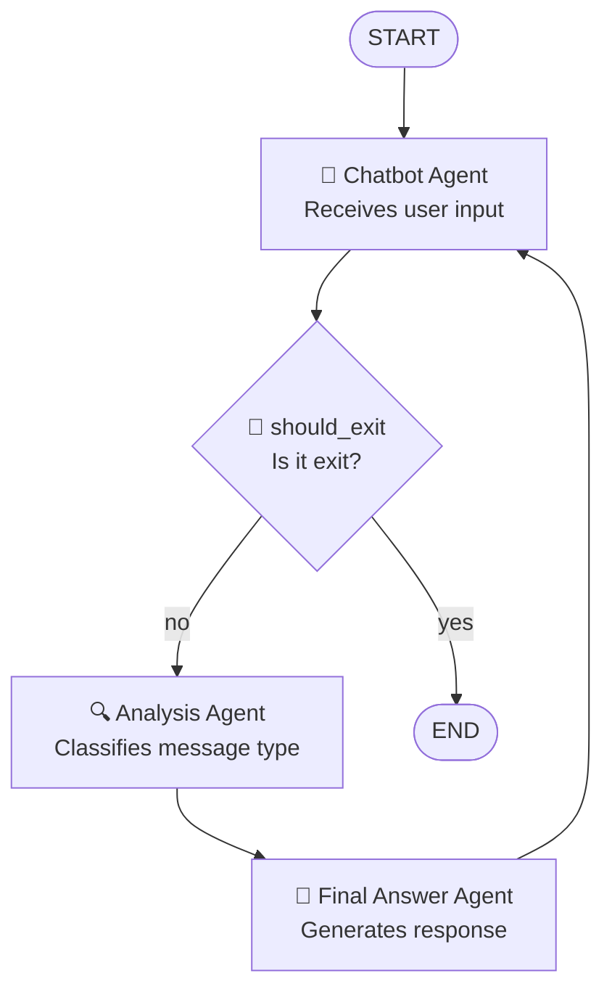

# Multi-Agents Chatbot

A learning project to understand LangGraph workflows and agent creation. This chatbot demonstrates how to build multi-agent systems using LangGraph without LLM connections, focusing on workflow design, conditional routing, and agent orchestration.

## 🏗️ System Architecture

The system uses an agent workflow with conditional routing:



## 🤖 System Components

### Agents
- **`chatbot_agent`**: Handles user input and controls conversation flow
- **`analysis_agent`**: Classifies message type (greeting, question, other)
- **`final_answer_agent`**: Generates appropriate response based on message type

### Conditional Router
- **`should_exit`**: Determines if the user wants to end the conversation

## 🔄 Workflow

1. **START** → `chatbot_agent` (receives user input)
2. **`chatbot_agent`** → `should_exit` (routing function)
3. **`should_exit`** evaluates:
   - **If "exit"** → **END** (terminates conversation)
   - **If not** → continues to `analysis_agent`
4. **`analysis_agent`** → Classifies message type (greeting/question/other)
5. **`final_answer_agent`** → Generates appropriate response based on type
6. **Loop** → Returns to `chatbot_agent` to continue conversation

## 🚀 Usage

```bash
# Install dependencies
uv sync

# Run the chatbot
uv run python main.py
```

## 📝 Supported Message Types

- **Greeting**: "hello", "hi", "hola" → Greeting response
- **Question**: Text ending with "?" → "I don't know" response
- **Other**: Any other text → Generic response

## 🎯 Learning Objectives

This project focuses on understanding:
- **LangGraph workflows**: How to create and connect agent nodes
- **Conditional routing**: Implementing decision logic in workflows
- **Agent design**: Creating specialized agents with single responsibilities
- **State management**: Handling data flow between agents
- **Workflow orchestration**: Building circular and conditional flows

## 🛠️ Technologies

- **Python 3.12+**
- **LangGraph**: Framework for agent workflows (no LLM connections)
- **LangChain**: Base for message system
- **uv**: Package manager

> **Note**: This project intentionally avoids LLM connections to focus on LangGraph fundamentals and workflow design patterns.

## 📊 Features

- ✅ **Conditional routing** for controlled termination
- ✅ **Robust type handling** without `None` cases
- ✅ **Circular workflow** for continuous conversations
- ✅ **Automatic classification** of message types
- ✅ **Clean termination** with "exit" command
- ✅ **Simple, explicit code** for learning LangGraph concepts
- ✅ **No LLM dependencies** - focuses on workflow design

## 🎓 Educational Value

This project is designed for learning LangGraph fundamentals:
- **Explicit agent functions** that are easy to understand
- **Clear workflow patterns** for agent orchestration
- **Simple state management** without complex LLM interactions
- **Conditional routing examples** for decision-making in workflows
- **Modular design** that can be extended with LLMs later
