# Multi-Agents Chatbot

A learning project to understand LangGraph workflows and agent creation. This project includes three implementations:

1. **`non-llm-chatbot.py`**: Multi-agent system without LLM connections, focusing on workflow design
2. **`llm-chatbot.py`**: Multi-agent system with LLM integration using Ollama (llama3.2:3b)  
3. **`hybrid-chatbot.py`**: Hybrid approach combining LangGraph orchestration with `create_agent` from LangChain for specialized sub-agents

See [HYBRID_PATTERN.md](HYBRID_PATTERN.md) for understanding the hybrid pattern.

## 🏗️ System Architecture

The system uses an agent workflow with conditional routing:

```mermaid
graph TD;
	start([START])
	chatbot["🤖 Chatbot Agent<br/>Receives user input"]
	router{"🔀 should_exit<br/>Is it exit?"}
	analysis["🔍 Analysis Agent<br/>Classifies message type"]
	final_answer["💬 Final Answer Agent<br/>Generates response"]
	finish([END])
	
	start --> chatbot
	chatbot --> router
	router -->|yes| finish
	router -->|no| analysis
	analysis --> final_answer
	final_answer --> chatbot
```



## 🤖 System Components

### Agents
- **`chatbot_agent`**: Handles user input and controls conversation flow
- **`analysis_agent`**: Classifies message type (greeting, question, other)
- **`final_answer_agent`**: Generates appropriate response based on message type

### Conditional Router
- **`should_exit`**: Determines if the user wants to end the conversation

## 🔄 Workflow

1. **START** → `chatbot_agent` (receives user input)
2. **`chatbot_agent`** → `should_exit` (routing function)
3. **`should_exit`** evaluates:
   - **If "exit"** → **END** (terminates conversation)
   - **If not** → continues to `analysis_agent`
4. **`analysis_agent`** → Classifies message type (greeting/question/other)
5. **`final_answer_agent`** → Generates appropriate response based on type
6. **Loop** → Returns to `chatbot_agent` to continue conversation

## 🚀 Usage

### Option 1: Non-LLM Chatbot (Learning LangGraph Fundamentals)

```bash
# Install dependencies
uv sync

# Run the non-LLM chatbot
uv run python non-llm-chatbot.py
```

### Option 2: LLM-Powered Chatbot with Manual LangGraph (LLM Integration)

**Prerequisites:**
- Install [Ollama](https://ollama.ai/)
- Pull the model: `ollama pull llama3.2:3b`
- Make sure Ollama is running: `ollama serve`

```bash
# Install dependencies
uv sync

# Run the LLM chatbot
uv run python llm-chatbot.py
```

### Option 3: Hybrid Pattern (LangGraph + create_agent)

**Prerequisites:** Same as Option 2

```bash
# Install dependencies
uv sync

# Run the hybrid chatbot
uv run python hybrid-chatbot.py
```

## 📝 Supported Message Types

### Non-LLM Chatbot (`non-llm-chatbot.py`)
- **Greeting**: "hello", "hi", "hola" → Predefined greeting response
- **Question**: Text ending with "?" → Predefined "I don't know" response
- **Other**: Any other text → Predefined generic response

### LLM Chatbot (`llm-chatbot.py`)
- **Greeting**: Detected by LLM with structured output → Contextual warm greeting
- **Question**: Detected by LLM with structured output → Intelligent answer generated by LLM
  - Uses detailed prompts with examples (?, who/what/where/when/why/how patterns)
- **Other**: Any other text → Contextual response from LLM

**Technical Features:**
- Uses `with_structured_output()` with Pydantic for reliable classification
- Temperature 0.0 for classification (deterministic)
- Temperature 0.7 for responses (creative)
- Stores both user messages (`HumanMessage`) and bot responses (`AIMessage`) in history
- Prompts are customized based on message type for better context

### Hybrid Chatbot (`hybrid-chatbot.py`)
Same behavior as `llm-chatbot.py`, but with different architecture:

**Technical Features:**
- Uses `create_agent` with `response_format` parameter for structured output
- Returns validated Pydantic objects in `result["structured_response"]`
- Middleware (`@dynamic_prompt`) for dynamic system prompts
- More modular: each agent is self-contained and reusable
- Same temperatures: 0.0 for classification, 0.7 for responses
- Same message history management as `llm-chatbot.py`

## 🎯 Learning Objectives

This project focuses on understanding:
- **LangGraph workflows**: How to create and connect agent nodes
- **Conditional routing**: Implementing decision logic in workflows
- **Agent design**: Creating specialized agents with single responsibilities
- **State management**: Handling data flow between agents
- **Workflow orchestration**: Building circular and conditional flows

## 🛠️ Technologies

- **Python 3.13+**
- **LangGraph**: Framework for agent workflows
- **LangChain**: Base for message system and model integrations
- **LangChain-Ollama**: Integration with Ollama models
- **Ollama**: Local LLM runtime (llama3.2:3b)
- **uv**: Package manager

## 📚 Three Learning Paths

### Path 1: `non-llm-chatbot.py` - LangGraph Fundamentals
Focus on understanding LangGraph without the complexity of LLMs:
- Pure workflow design patterns
- Conditional routing logic
- State management
- Agent orchestration
- Deterministic agent behavior

### Path 2: `llm-chatbot.py` - LLM Integration
Build upon Path 1 by adding intelligent responses:
- Integrating ChatOllama with LangGraph nodes
- LLM-powered message classification with **structured output**
- Context-aware response generation
- Dual temperature strategy (0.0 for classification, 0.7 for responses)
- Managing conversation history
- Trusting the LLM (no fallbacks for educational clarity)

### Path 3: `hybrid-chatbot.py` - Hybrid Pattern (Best of Both)
Combine LangGraph orchestration with create_agent specialists:
- **LangGraph** for workflow control (same graph structure)
- **create_agent** for individual specialized agents
- **Middleware** in each sub-agent
- Agent-level customization + workflow-level control
- Scales to complex multi-agent systems
- Production-ready pattern for large applications

## 📊 Features

### Common to Both Implementations
- ✅ **Conditional routing** for controlled termination
- ✅ **Robust type handling** with TypedDict
- ✅ **Circular workflow** for continuous conversations
- ✅ **Clean termination** with "exit" command
- ✅ **Simple, explicit code** for learning LangGraph concepts

### Non-LLM Chatbot Specific
- ✅ **No LLM dependencies** - pure workflow focus
- ✅ **Regex-based classification** - deterministic behavior
- ✅ **Predefined responses** - fast and predictable

### LLM Chatbot Specific (`llm-chatbot.py`)
- ✅ **Structured output classification** - guaranteed valid types with Pydantic (`with_structured_output`)
- ✅ **Dual temperature strategy** - 0.0 for classification, 0.7 for responses
- ✅ **Detailed classification prompts** - includes examples and patterns for better accuracy
- ✅ **Dynamic response generation** - contextual and natural responses
- ✅ **Complete conversation history** - stores both user and assistant messages
- ✅ **Context-aware prompts** - different system prompts based on message type
- ✅ **Simplified code** - trusts the LLM without fallbacks (educational)
- ✅ **Local LLM** - privacy-focused with Ollama

### Hybrid Chatbot Specific (`hybrid-chatbot.py`)
- ✅ **create_agent structured output** - uses `response_format` parameter
- ✅ **Middleware support** - dynamic prompts with `@dynamic_prompt` decorator
- ✅ **Modular agent design** - each agent is self-contained and reusable
- ✅ **Agent-level configuration** - independent temperature, tools, and middleware per agent
- ✅ **Production-ready pattern** - scales to complex multi-agent systems
- ✅ **Same LLM capabilities** - same intelligence and context-awareness as llm-chatbot

## 🎓 Educational Value

This project is designed for progressive learning:

### Stage 1: `non-llm-chatbot.py`
- **Explicit agent functions** that are easy to understand
- **Clear workflow patterns** for agent orchestration
- **Simple state management** without complex LLM interactions
- **Conditional routing examples** for decision-making in workflows
- **Foundation** for understanding LangGraph architecture

### Stage 2: `llm-chatbot.py`
- **LLM integration** within LangGraph nodes
- **Structured output** with Pydantic for reliable classification
- **Prompt engineering** for accurate classification with detailed instructions
- **Temperature control** for different agent behaviors (0.0 vs 0.7)
- **Context management** with full conversation history (HumanMessage + AIMessage)
- **Conditional prompting** based on message type classification
- **Simplified approach** trusting the LLM without fallbacks
- **Comparison** between deterministic and AI-powered agents

## 🔍 Key Differences

| Feature | non-llm-chatbot.py | llm-chatbot.py | hybrid-chatbot.py |
|---------|-------------------|----------------|-------------------|
| Classification | Regex-based | LLM + `with_structured_output` | LLM + `create_agent` + `response_format` |
| Classification Method | Pattern matching | Pydantic schema + detailed prompts + temp 0.0 | Same as llm-chatbot |
| Responses | Hardcoded | Direct LLM invocation (temp 0.7) | Via `create_agent` (temp 0.7) |
| Response Customization | Dict lookup | Manual system prompts | Middleware (`@dynamic_prompt`) |
| Context Awareness | None | Full conversation history | Full conversation history |
| Message History | Simple dicts | HumanMessage + AIMessage | HumanMessage + AIMessage |
| Agent Architecture | Manual nodes | Manual LLM calls | `create_agent` specialists |
| Modularity | Low | Medium | High (reusable agents) |
| Speed | Instant (~1ms) | 1-3 seconds | 1-3 seconds |
| Predictability | 100% deterministic | Classification consistent, responses varied | Classification consistent, responses varied |
| Code Complexity | Simple, explicit | Simple, trusts LLM | Modular, production-ready |
| Learning Focus | LangGraph workflow | LLM integration + prompt engineering | Hybrid pattern + middleware |
| Dependencies | Minimal | Requires Ollama | Requires Ollama |
| Best For | Learning basics | Direct control | Scalable systems |

## 🚦 Getting Started

**Recommended Learning Path:**
1. Start with `non-llm-chatbot.py` to understand LangGraph fundamentals
2. Compare the code structure and workflow (same graph, different implementations)
3. Move to `llm-chatbot.py` to see how LLMs enhance the agents
4. Observe how conversation history is maintained with `HumanMessage` + `AIMessage`
5. Try `hybrid-chatbot.py` to see how to combine LangGraph + create_agent
6. Compare all three approaches and understand trade-offs
7. Experiment with different prompts, temperatures, and models
8. Read [HYBRID_PATTERN.md](HYBRID_PATTERN.md) for understanding production patterns

**Quick Comparison:**
- **Learning LangGraph:** Start with `non-llm-chatbot.py`
- **Full Control:** Use `llm-chatbot.py`
- **Production/Scale:** Use `hybrid-chatbot.py`  
- **Complex Workflows:** Definitely `hybrid-chatbot.py`
